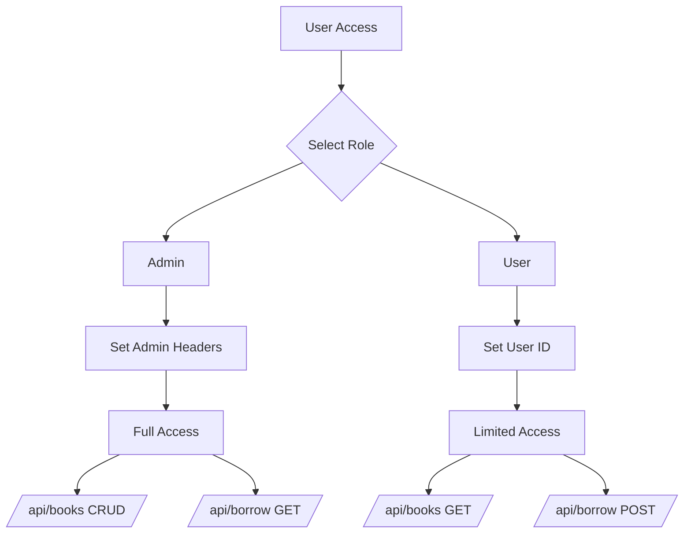

# **📚 Library Management System - Complete Documentation**

## **🚀 Cara Menjalankan Aplikasi Lengkap**

### **Prerequisites**
- **Node.js** (v14 atau lebih baru)
- **npm** atau **yarn**
- **Database** (MySQL/PostgreSQL/SQLite)
- **Git** (opsional)
- **Postman** (untuk testing API)

---

## **🎯 Option 1: Full Setup dengan Vite (Rekomendasi)**

### **Step 1: Clone Repository**
```bash
git clone <repository-url>
cd library-system
```

### **Step 2: Backend Setup**
```bash
# Masuk ke folder backend
cd backend

# Install dependencies
npm install

# Buat file .env
cat > .env << EOF
DB_HOST=localhost
DB_NAME=library_db
DB_USER=root
DB_PASS=password
DB_DIALECT=mysql
PORT=3000
JWT_SECRET=your-secret-key-here
EOF

# Setup database MySQL
mysql -u root -p -e "CREATE DATABASE IF NOT EXISTS library_db;"

# Jalankan migrasi database (auto-sync)
npm start
```

### **Step 3: Frontend Setup**
```bash
# Buka terminal baru
cd frontend

# Install dependencies
npm install

# Jalankan dev server
npm run dev

# Buka browser:
# http://localhost:5173
```

---

## **🌐 API Documentation (Postman)**

### **Base URL**
```
http://localhost:3000/api
```

### **📚 Books API Endpoints**

| Method | Endpoint | Headers | Body | Response |
|--------|----------|---------|------|----------|
| **GET** | `/books` | None | None | `{success: true, data: [...]}` |
| **GET** | `/books/:id` | None | None | `{success: true, data: {...}}` |
| **POST** | `/books` | `x-user-role: admin` | `{title, author, stock}` | `{success: true, data: {...}}` |
| **PUT** | `/books/:id` | `x-user-role: admin` | `{title, author, stock}` | `{success: true, data: {...}}` |
| **DELETE** | `/books/:id` | `x-user-role: admin` | None | `{success: true, message: "..."}` |

### **📍 Borrow API Endpoints**

| Method | Endpoint | Headers | Body | Response |
|--------|----------|---------|------|----------|
| **POST** | `/borrow` | `x-user-role: user`<br>`x-user-id: 123` | `{bookId, latitude, longitude}` | `{success: true, data: {...}}` |
| **GET** | `/borrow/user/:userId` | `x-user-role: user/admin`<br>`x-user-id: <id>` | None | `{success: true, data: [...]}` |
| **GET** | `/borrow` | `x-user-role: admin` | None | `{success: true, data: [...]}` |
| **DELETE** | `/borrow/:id` | `x-user-role: user/admin`<br>`x-user-id: <id>` | None | `{success: true, message: "..."}` |

---

## **🔧 Postman Collection Setup**

### **1. Import Postman Collection**
```json
{
  "info": {
    "name": "Library Management System API",
    "schema": "https://schema.getpostman.com/json/collection/v2.1.0/collection.json"
  },
  "item": [
    {
      "name": "Books",
      "item": [
        {
          "name": "Get All Books",
          "request": {
            "method": "GET",
            "url": "http://localhost:3000/api/books"
          }
        },
        {
          "name": "Get Book by ID",
          "request": {
            "method": "GET",
            "url": "http://localhost:3000/api/books/1"
          }
        },
        {
          "name": "Create Book (Admin)",
          "request": {
            "method": "POST",
            "header": [
              {
                "key": "x-user-role",
                "value": "admin"
              },
              {
                "key": "Content-Type",
                "value": "application/json"
              }
            ],
            "url": "http://localhost:3000/api/books",
            "body": {
              "mode": "raw",
              "raw": "{\n  \"title\": \"Sample Book\",\n  \"author\": \"John Doe\",\n  \"stock\": 5\n}"
            }
          }
        }
      ]
    }
  ]
}
```

### **2. Environment Variables di Postman**
```
BASE_URL: http://localhost:3000
ADMIN_ROLE: admin
USER_ROLE: user
USER_ID: 123
ADMIN_ID: admin1
```

---

## **📊 Database Models & ERD**

### **📚 Book Model**
```javascript
Book {
  id: INTEGER (PK, AutoIncrement)
  title: STRING (NOT NULL)
  author: STRING (NOT NULL)
  stock: INTEGER (DEFAULT: 1, MIN: 0)
}
```

### **📍 BorrowLog Model**
```javascript
BorrowLog {
  id: INTEGER (PK, AutoIncrement)
  userId: INTEGER (NOT NULL)
  bookId: INTEGER (FK → Book.id)
  latitude: FLOAT (NOT NULL)
  longitude: FLOAT (NOT NULL)
}
```

### **🔗 Relationships**
```
Book (1) ←→ (Many) BorrowLog
```

---

## **🖼️ Screenshot Gallery**

### **Backend API (Postman)**

#### **1. GET /api/books** - Melihat semua buku


#### **2. GET /api/books/:id** - Detail buku


#### **3. POST /api/books** - Tambah buku baru (Admin)


#### **4. PUT /api/books/:id** - Update buku (Admin)


#### **5. DELETE /api/books/:id** - Hapus buku (Admin)


#### **6. POST /api/borrow** - Meminjam buku (User)


#### **7. Validasi Error** - Stock habis


### **Database Tables**

#### **8. Book Table Structure**


#### **9. BorrowLog Table Structure**


### **Frontend Application**

#### **10. Dashboard Utama**


#### **11. Pilih Role**


#### **12. Cek Ketersediaan Buku**


#### **13. Form Pinjam Buku**


#### **14. Detail Buku (User)**


#### **15. Halaman Admin**


#### **16. Detail Buku (Admin)**


#### **17. Tambah Buku (Admin)**


#### **18. Update Buku (Admin)**


#### **19. Hapus Buku (Admin)**


---

## **🔍 Step-by-Step Testing dengan Postman**

### **Test 1: Setup Admin Role**
```http
POST http://localhost:3000/api/books
Headers:
  x-user-role: admin
  Content-Type: application/json

Body:
{
  "title": "Test Book 1",
  "author": "Test Author",
  "stock": 10
}
```

### **Test 2: Setup User Role**
```http
POST http://localhost:3000/api/borrow
Headers:
  x-user-role: user
  x-user-id: 123
  Content-Type: application/json

Body:
{
  "bookId": 1,
  "latitude": -6.2088,
  "longitude": 106.8456
}
```

### **Test 3: View Borrowed Books**
```http
GET http://localhost:3000/api/borrow/user/123
Headers:
  x-user-role: user
  x-user-id: 123
```

### **Test 4: Admin View All Borrows**
```http
GET http://localhost:3000/api/borrow
Headers:
  x-user-role: admin
```

---

## **⚙️ Konfigurasi Database**

### **MySQL Configuration**
```sql
-- 1. Create database
CREATE DATABASE library_db CHARACTER SET utf8mb4 COLLATE utf8mb4_unicode_ci;

-- 2. Create user
CREATE USER 'library_user'@'localhost' IDENTIFIED BY 'password123';

-- 3. Grant privileges
GRANT ALL PRIVILEGES ON library_db.* TO 'library_user'@'localhost';

-- 4. Flush privileges
FLUSH PRIVILEGES;

-- 5. Use database
USE library_db;

-- 6. Verify tables (akan dibuat otomatis oleh Sequelize)
SHOW TABLES;
```

### **Environment Variables (.env)**
```env
# Database Configuration
DB_HOST=localhost
DB_PORT=3306
DB_NAME=library_db
DB_USER=root
DB_PASS=password
DB_DIALECT=mysql

# Server Configuration
PORT=3000
NODE_ENV=development

# Security
JWT_SECRET=your-super-secret-jwt-key-here
SESSION_SECRET=your-session-secret-key

# CORS
CORS_ORIGIN=http://localhost:5173
```

---

## **🐛 Troubleshooting Common Issues**

### **Issue 1: Database Connection Error**
```bash
# Check MySQL service
sudo service mysql status

# Start MySQL if not running
sudo service mysql start

# Login to MySQL
mysql -u root -p

# Check if database exists
SHOW DATABASES;
```

### **Issue 2: Port Already in Use**
```bash
# Find process using port 3000
lsof -i :3000

# Kill the process
kill -9 <PID>

# Or use different port
PORT=3001 npm start
```

### **Issue 3: CORS Error**
```javascript
// In backend/server.js
const cors = require('cors');

app.use(cors({
  origin: ['http://localhost:5173', 'http://localhost:8080'],
  methods: ['GET', 'POST', 'PUT', 'DELETE'],
  credentials: true
}));
```

### **Issue 4: Sequelize Sync Error**
```bash
# Force sync (HATI-HATI: menghapus semua data!)
npx sequelize db:drop
npx sequelize db:create
npx sequelize db:migrate

# Atau gunakan auto-sync dengan force: false
sequelize.sync({ force: false, alter: true });
```

---

## **📱 Responsive Design Matrix**

| Device | Screen Size | Features | Status |
|--------|-------------|----------|--------|
| **Desktop** | > 1200px | Full features, sidebar nav | ✅ Perfect |
| **Laptop** | 992px - 1200px | Full features, compact layout | ✅ Excellent |
| **Tablet** | 768px - 991px | Responsive cards, hamburger menu | ✅ Good |
| **Mobile** | < 768px | Stacked layout, touch-friendly | ✅ Good |
| **Print** | N/A | Print-friendly styles | ⚠️ Basic |

---

## **🔐 Authentication Flow**



---

## **🎯 Quick Test Scripts**

### **Bash Test Script**
```bash
#!/bin/bash
# test-api.sh

echo "Testing Library Management System API..."

# Test 1: Get all books
echo "1. Testing GET /api/books..."
curl -X GET http://localhost:3000/api/books

# Test 2: Create a book (admin)
echo -e "\n2. Testing POST /api/books..."
curl -X POST http://localhost:3000/api/books \
  -H "x-user-role: admin" \
  -H "Content-Type: application/json" \
  -d '{"title":"API Test Book","author":"Test Author","stock":5}'

# Test 3: Borrow a book (user)
echo -e "\n3. Testing POST /api/borrow..."
curl -X POST http://localhost:3000/api/borrow \
  -H "x-user-role: user" \
  -H "x-user-id: 100" \
  -H "Content-Type: application/json" \
  -d '{"bookId":1,"latitude":-6.2088,"longitude":106.8456}'

echo -e "\nAPI Tests Completed!"
```

### **Node.js Test Script**
```javascript
// test-api.js
const axios = require('axios');

const API_BASE = 'http://localhost:3000/api';

async function runTests() {
  console.log('🚀 Starting API Tests...\n');
  
  // Test 1: Get all books
  try {
    const res1 = await axios.get(`${API_BASE}/books`);
    console.log('✅ GET /books - Success:', res1.data.data.length, 'books');
  } catch (err) {
    console.log('❌ GET /books - Failed:', err.message);
  }
  
  // Test 2: Create book as admin
  try {
    const res2 = await axios.post(`${API_BASE}/books`, {
      title: 'Automated Test Book',
      author: 'Test Bot',
      stock: 3
    }, {
      headers: { 'x-user-role': 'admin' }
    });
    console.log('✅ POST /books - Book created:', res2.data.data.title);
  } catch (err) {
    console.log('❌ POST /books - Failed:', err.message);
  }
  
  // Test 3: Borrow book as user
  try {
    const res3 = await axios.post(`${API_BASE}/borrow`, {
      bookId: 1,
      latitude: -6.2088,
      longitude: 106.8456
    }, {
      headers: { 
        'x-user-role': 'user',
        'x-user-id': '999'
      }
    });
    console.log('✅ POST /borrow - Book borrowed');
  } catch (err) {
    console.log('❌ POST /borrow - Failed:', err.message);
  }
  
  console.log('\n📊 All tests completed!');
}

runTests();
```

---

## **📦 Deployment Checklist**

### **Pre-Deployment**
- [ ] Database backup completed
- [ ] Environment variables configured
- [ ] CORS settings updated
- [ ] SSL certificate installed
- [ ] Load balancer configured (if needed)

### **Post-Deployment**
- [ ] API endpoints tested
- [ ] Frontend connected successfully
- [ ] Database migrations applied
- [ ] Error logging configured
- [ ] Performance monitoring enabled

---

## **📞 Support & Resources**

| Resource | Link | Description |
|----------|------|-------------|
| **API Documentation** | `/api-docs` | Swagger documentation |
| **GitHub Repository** | `github.com/your-repo` | Source code |
| **Issue Tracker** | `github.com/your-repo/issues` | Bug reports |
| **Postman Collection** | `Link` | API test collection |
| **Database Schema** | `schema.sql` | SQL schema file |

---

## **✅ Final Verification**

```bash
# Run these commands to verify installation
cd backend && npm test
cd frontend && npm run build

# Check services
curl http://localhost:3000/api/books
curl http://localhost:3000/health

# Check database
mysql -u root -p -e "USE library_db; SHOW TABLES;"
```

---

**🎉 Congratulations! Your Library Management System is now ready!**

**Need help?** Check the troubleshooting section or create an issue in the repository.

**Want to contribute?** Fork the repo and submit a pull request!

**⭐ Don't forget to star the repository if you find it useful!**
